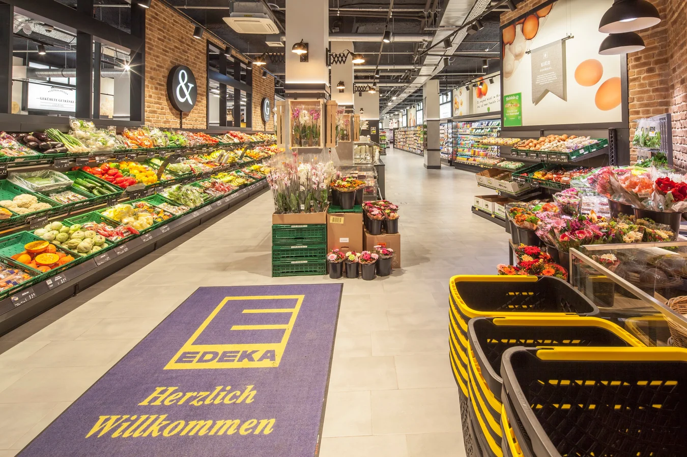

# SoDap - Solana Decentralized Shopping

<div align="center">
  
  <p><strong>Decentralized Shopping Powered by Solana</strong></p>
</div>

## 📋 Overview

SoDap is a decentralized shopping platform built on Solana blockchain technology. It enables store owners to manage products, customers to shop securely, and integrates with Solana wallets for seamless blockchain transactions.

## ✨ Features

### 🔐 Authentication
- **Multi-user Login System**: Support for customers, store owners, and platform admins
- **Protected Routes**: Secure access to marketplace and admin areas
- **Wallet Integration**: Connect with Solana wallets for blockchain transactions

### 🏪 Store Management
- **Product Registration**: Store products with unique UUIDs mapped to PDAs
- **Inventory Tracking**: Real-time stock level management
- **QR Code Integration**: Scan product QR codes for quick access

### 🛒 Shopping Experience
- **Modern Marketplace**: Browse and purchase products
- **Secure Checkout**: Process transactions on Solana blockchain
- **Order History**: Track past purchases and delivery status

### 👨‍💼 Admin Dashboard
- **Store Owner Portal**: Manage products, inventory, and sales
- **Platform Admin Controls**: Oversee platform operations
- **Analytics**: Track sales and user engagement metrics

## 🚀 Getting Started

### Prerequisites
- Node.js 16+
- npm or yarn
- Solana CLI tools (for blockchain interaction)

### Installation

```bash
# Clone the repository
git clone https://github.com/tenrikut/sodap.git
cd sodap-app

# Install dependencies
npm install

# Set up environment variables
cp .env.example .env.local
# Edit .env.local with your configuration

# Run development server
npm run dev
```

### Demo Credentials

For testing purposes, you can use these demo accounts:

- **Customer**:
  - Username: `sodap`
  - Password: `sodap`

- **Test User with Wallet**:
  - Username: `tamkin`
  - Password: `test1234`
  - Wallet: `9yg11hJpMpreQmqtCoVxR55DgbJ248wiT4WuQhksEz2J`

## 🏗️ Architecture

### Frontend (Next.js)
- **App Router**: Modern Next.js architecture with server components
- **Authentication**: Custom auth system with protected routes
- **UI Framework**: Chakra UI for responsive design
- **State Management**: React Context API for global state

### Backend (Solana Programs)
- **Product Management**: On-chain product data storage and retrieval
- **Transaction Processing**: Secure payment handling
- **Account Structure**: PDAs for relational data storage

## 📊 Data Models

### On-Chain Product Data

```rust
#[account]
pub struct Product {
    pub product_uuid: [u8; 16],  // Unique identifier stored as byte array
    pub store_id: Pubkey,        // Store that owns this product
    pub price: u64,              // Price in lamports (SOL)
    pub stock: u64,              // Current inventory level
    pub tokenized_type: TokenizedType, // None or SPL token
    pub metadata_uri: String,    // Off-chain data URI or inline JSON
    pub created_at: i64,         // Creation timestamp
    pub mint_status: MintStatus, // Status for tokenized products
    pub deactivated: bool,       // Product active status
}
```

### Frontend Product Interface

```typescript
export interface Product {
  id: string;              // UUID in string format
  name: string;            // Product name
  description: string;     // Product description
  price: number;           // Price in SOL
  inventory: number;       // Stock quantity
  imageUrl?: string;       // Product image
  category?: string;       // Product category
  tokenizedType: "None" | "SplToken"; // Tokenization type
  isActive: boolean;       // Product status
  createdAt?: number;      // Creation timestamp
}
```

## 🔄 Workflow

1. **User Authentication**:
   - Login via username/password
   - Connect Solana wallet for transactions

2. **Shopping**:
   - Browse marketplace products
   - Add items to cart
   - Checkout with Solana wallet

3. **Store Management**:
   - Add and update products
   - Track inventory and sales
   - Generate QR codes for physical products

## 🧪 Development

```bash
# Run tests
npm test

# Build for production
npm run build

# Start production server
npm start
```

## 📱 Responsive Design

SoDap is fully responsive and works on:
- 📱 Mobile devices
- 💻 Tablets
- 🖥️ Desktop computers

## 🤝 Contributing

Contributions are welcome! Please feel free to submit a Pull Request.

## 📄 License

This project is licensed under the MIT License - see the LICENSE file for details.

## 📞 Contact

For questions or support, please reach out to the SoDap team.
